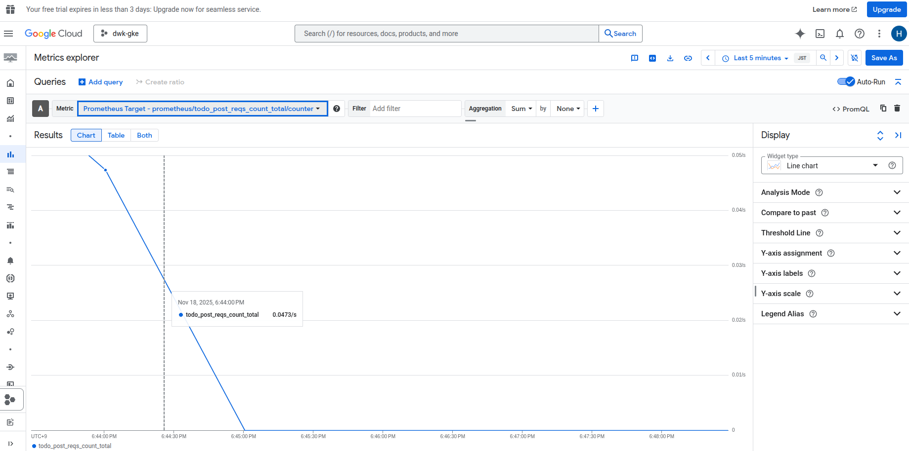

## The Project
### 3.12.1 Intermission?

```plaintext
No longer using JSON SA key -> need to setup workload federation + SA impersonation
These must be present in github secrets
${{ secrets.GKE_PROJECT }} -> project id
${{ secrets.GKE_PROJECT_NAME }}
${{ secrets.GKE_PROJECT_NUMBER }}
${{ secrets.GSA_ID }} -> the front part of the SA email
```

- Follow instructions on [3.11](https://github.com/classroom-dee/hobbernetes/tree/3.11/simple_http)
- Go to the observation deck! [metrics explorer](https://console.cloud.google.com/monitoring/metrics-explorer)
- Select metrics -> Prometheus target -> Query "Todo" -> select .../count
